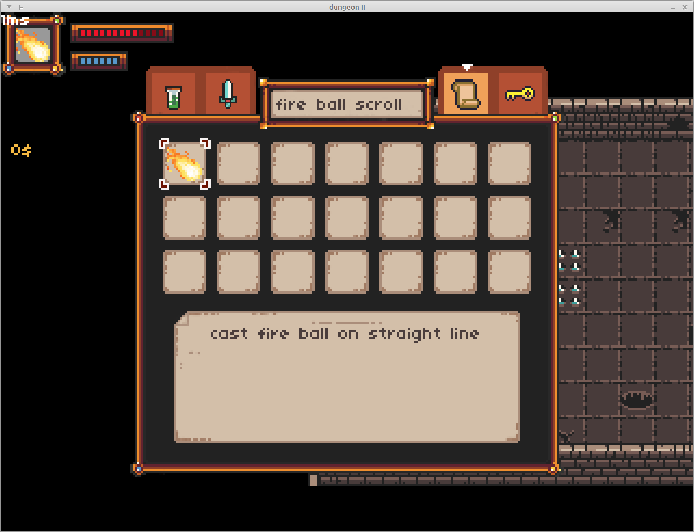
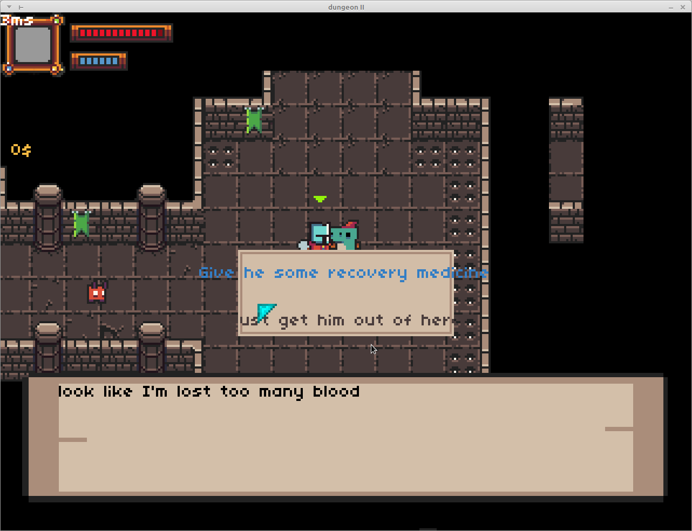

# UZU


#  Build Instructions
###  Prerequisites: 
* **gcc** or **clang** compiler 
* **cmake >=3.1**
* **ninja**
### Install dependencies

#### sdl2 libraries
install sdl libraries via apt
```
$ sudo apt-get install libsdl2-dev libsdl2-gfx-dev libsdl2-image-dev libsdl2-mixer-dev
```
#### json-c
uzu depends on json-c so we need too install it too, but from source.
```
$ git clone https://github.com/json-c/json-c.git
$ mkdir json-c-build
$ cd json-c-build
$ cmake ../json-c  -DBUILD_STATIC_LIBS=TRUE
$ make install
```
### Build & run
```
$ mkdir build && cd build
$ cmake ..
$ make && ./uzu
```
